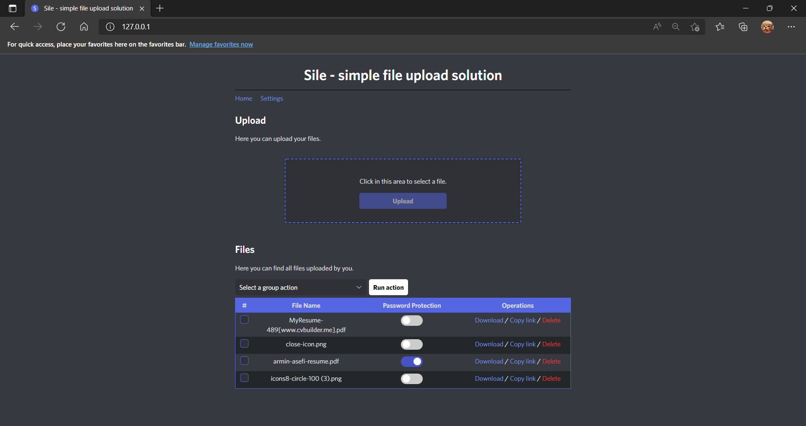
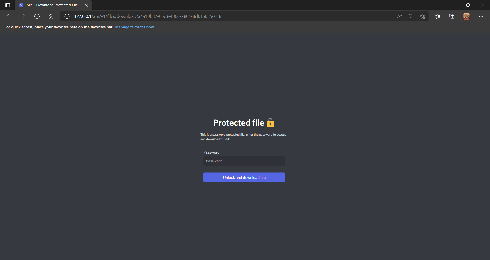

# Sile
Sile is simple file upload solution that you can easily install and run on your server. It's minimal and suitable for lightweight servers.

- Minimal and clean coded
- Written using signite framework which supports MVC as well
- ✨Magic ✨

## Features

- Safe login and registration.
- Powerful and customizable file upload rules
- Protect files using password
- Fully MVC architecture
- File group operations

## Tech

Sile uses a number of open source projects to work properly:

- [PHP](https://www.php.net/) - PHP as backend hero!
- Signite framework - minimal PHP framework
- [jQuery] - frontend hero!
- [Discord theme](https://github.com/Clay-Devs/discordcss) ready to use CSS

And of course sile itself is open source with a [public repository](https://github.com/0xDeviI/Sile)
 on GitHub.

## Installation
##### Cause framework issues only works on apache servers right now.
###### Sile requires [PHP](https://www.php.net/) v7+ to run.
Install the requirements and then clone this repo.

```sh
git clone https://github.com/0xDeviI/Sile.git
```
move sile files to your apache root path and check out 127.0.0.1, That's it!


## Screenshots






## License
[MIT](https://github.com/0xDeviI/Sile/blob/main/LICENSE)
**Free Software, Hell Yeah!**